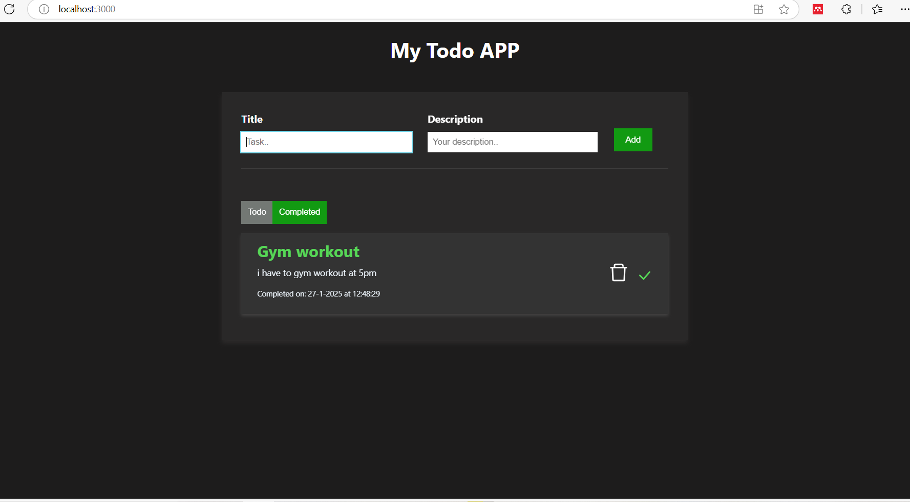

# 📝 To-Do App

A simple and elegant To-Do app built with **React** to help users manage tasks efficiently. This app allows you to create, update, and delete tasks, providing a seamless user experience with a responsive design.

---

---

## 🚀 Features

- **Add Tasks**: Quickly add tasks with a clear input field.  
- **Mark as Complete**: Mark tasks as completed to keep track of progress.   
- **Delete Tasks**: Remove completed or unwanted tasks effortlessly.  
- **Responsive Design**: Works flawlessly on both desktop and mobile devices.  

---

## 🛠️ Tech Stack

- **Frontend**: React (with Hooks)  
- **Styling**: CSS/Styled Components/Tailwind CSS  

